# Installation

## Steps

- Run Raspberry PI Imager

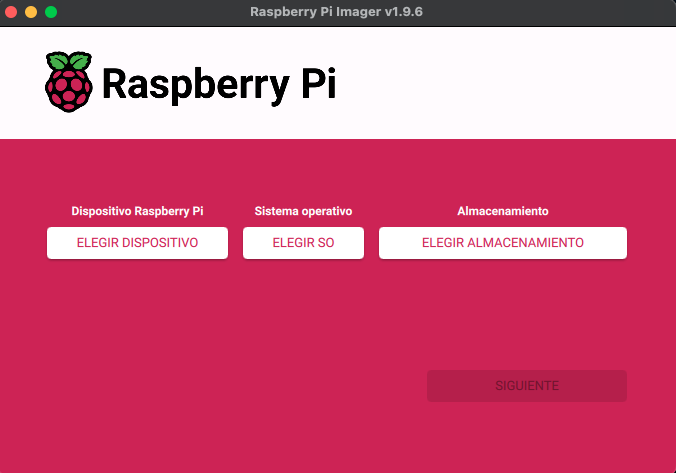

- Select Raspberry version: Raspberry PI Zero 2 W

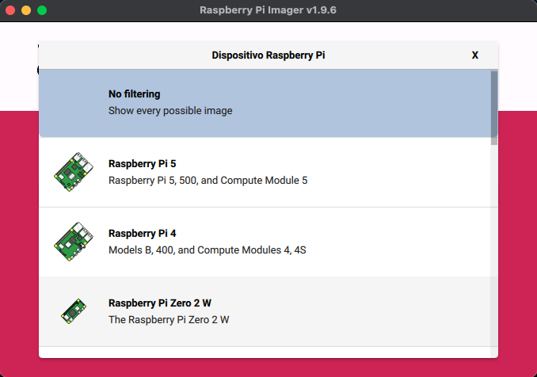

- Select Operative System: Other specific-purpose OS

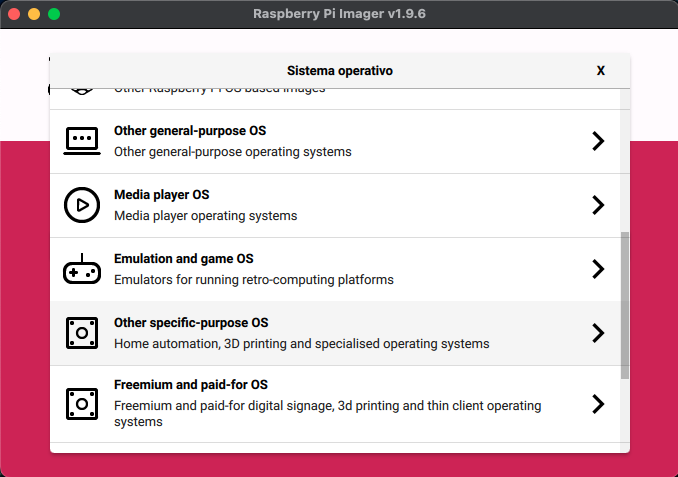

- Select Operative System: Kali Linux

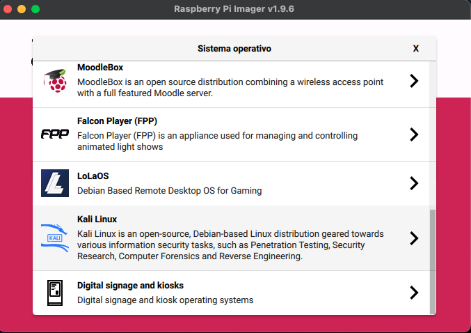

- Select Operative System: Kali Linux Pi Zero 2 W

- Select Storage: Select Micro SD

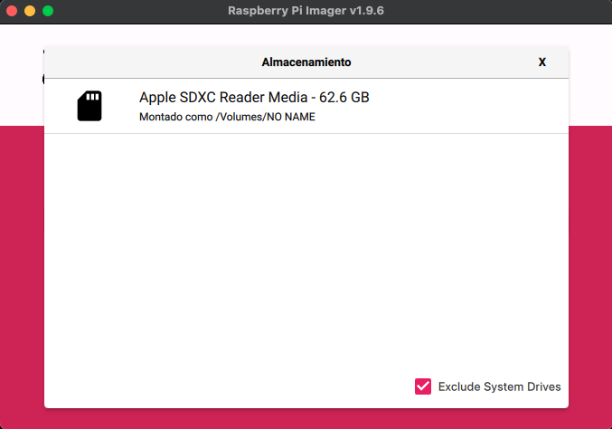

- Edit Settings

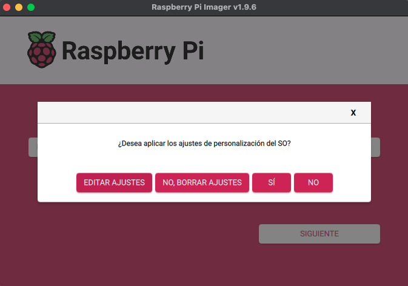

- Edit Settings
  - Name: kalilinux

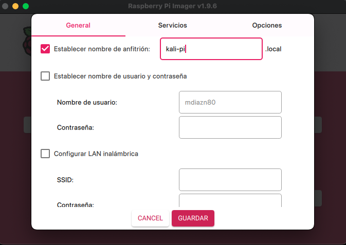

- Yes

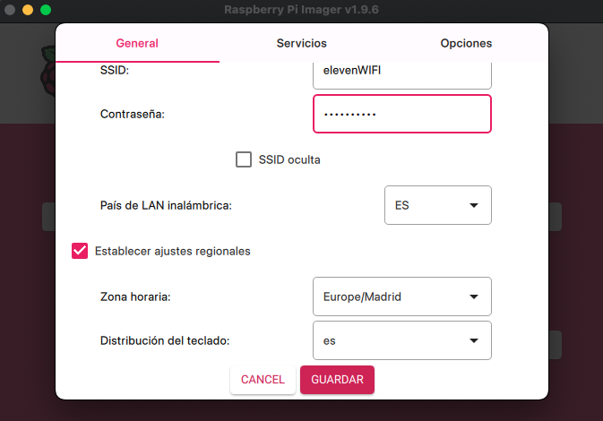

- Writting...

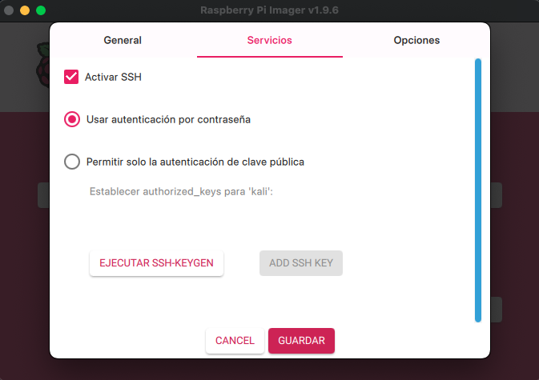

- Writting...

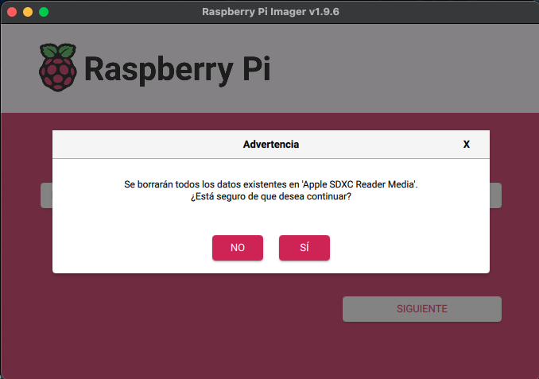

- Verify

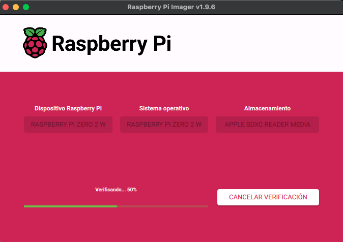

- Writting Succes: Confirm

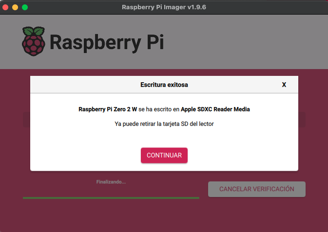
