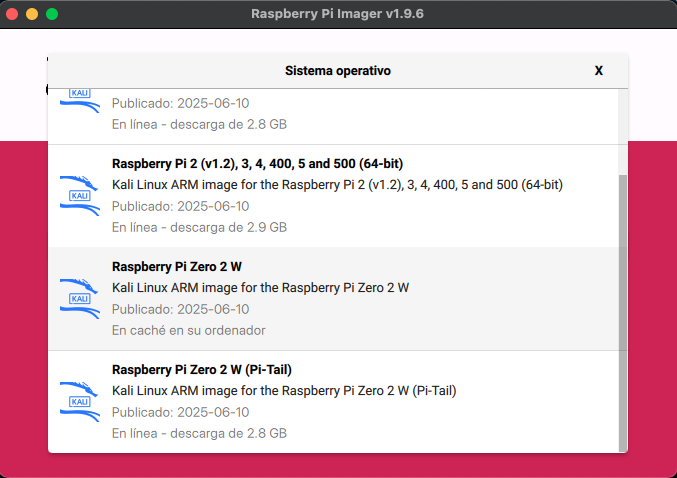
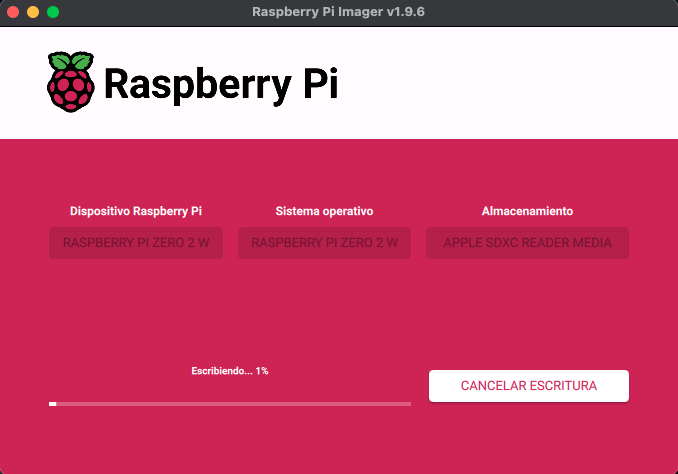
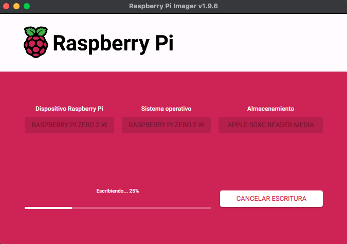
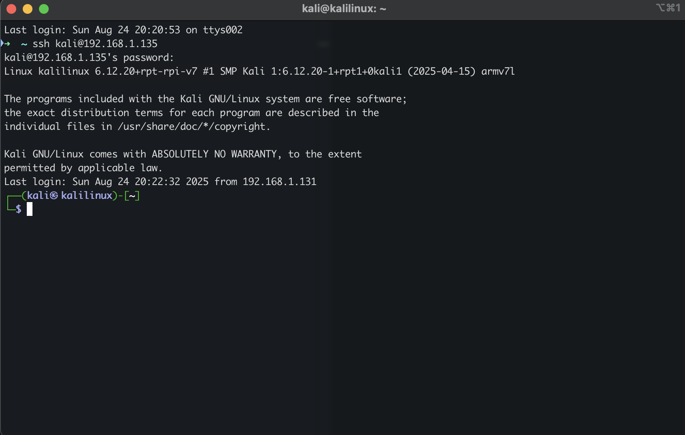

# Installation

## Steps

- Run Raspberry PI Imager

- Select Raspberry version: Raspberry PI Zero 2 W

- Select Operative System: Other specific-purpose OS

- Select Operative System: Kali Linux

- Select Operative System: Kali Linux Pi Zero 2 W

- Select Storage: Select Micro SD

- Edit Settings

- Edit Settings
  - Name: kalilinux
  - Username and Password
    - User: kali
    - Pass: ***
  - WIFI settings:
    - WIFI Name: ***
    - WIFI pass: ***

- Edit Settings

- Edit Settings

- Yes

- Writting...

- Writting...

- Verify

- Writting Succes

- Insert the microSD into the Raspberry Pi Zero 2 W and boot it up.  
